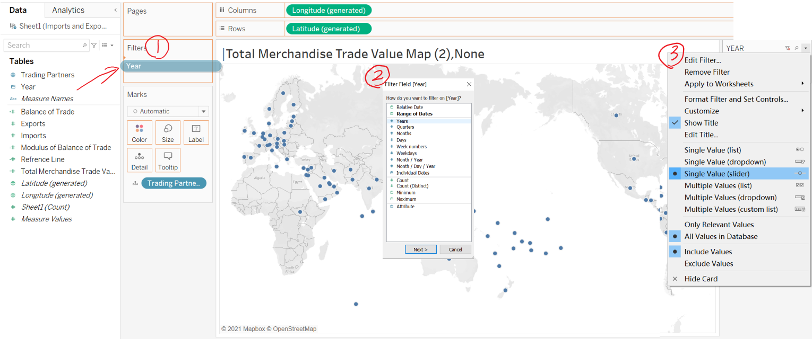

```{r setup, include=FALSE}
knitr::opts_chunk$set(echo = FALSE)
```

In this article, we will rethink and rework a data visualisation of bobble chart of [*"MERCHANDISE TRADE PERFORMANCE
WITH MAJOR TRADING PARTNERS, 2020"*](https://www.singstat.gov.sg/modules/infographics/singapore-international-trade) provided by prof Kam.

The data is provided by [*Department of Statisticcs, Singapore DOS*](https://www.singstat.gov.sg/find-data/search-by-theme/trade-and-investment/merchandise-trade/latest-data).

This is the original visualisation:

**Content:  **

1. Critique of Visualization  
    1.1 Clarity  
    1.2 Aesthetic  
2. Alternative Design  
    2.1 Draft  
    2.2 Improvement  
3. Proposed Visualization  
4. Step-by-step Guide  
5. Drived Insights  


# 1. Critique of Visualization

## 1.1 Clarity

**1.**
The coordinate unit is not indicated in the horizontal and vertical coordinates and the title. Although it can be inferred from the comments that it is S Dollar, Billion. But clear labeling obviously makes it easier for readers to understand.

**2.**
Lack of display of net exports and net imports. The author selected the first place based on net exports and net imports. However, there are neither figures nor reference lines in the figure. It is difficult for readers to see the data of a certain trading partner’s net exports or net imports from the figure. It is therefore difficult to understand what the author chose the first place based on.

**3.**
It is not possible to find a conclusion based on the known data. Below the graph, the author writes the conclusion Since 2009, the value of exports exceeds imports for Singapore's merchandise trade with Mainland China. However, the author can neither draw this conclusion from the graph nor write an external link to support his conclusion.

## 1.2 Aesthetic

**1.**
Because the white center is too small compared to the colored circles, it is difficult to see the specific location of the white center, and it is difficult to find whether the center is at the upper left or lower right of the diagonal, so it is difficult to determine whether the trading partner is a NET EXPORTER Still net importer.

**2.**
The circle is too large, causing the circle and the circle to block each other, and some circles are blocked by more than 75%.

**3.**
 Interaction is almost useless in this picture. We cannot get more or more accurate data through mutual operations.
 
 #  2. Alternative Design
## 2.1 draft
the design is drawn as a draft:

## 2.2 Improvement

**1. Add necessary information**

# 3. Proposed Visualization
In this data make over, the poposed visualisation is posted [here](https://public.tableau.com/app/profile/zhong.ping/viz/makeover2_1_16238966092570/MERCHANDISETRADEPERFORMANCEWITHMAJORTRADINGPARTNERS2011-2020_1).


# 4. Step-by-step Guide

**4.1.Data preparation**

Step1. First we download the data from [*DOS*](https://www.singstat.gov.sg/find-data/search-by-theme/trade-and-investment/merchandise-trade/latest-data).


Step2.   
Next we select monthly import and export value of each country (104 in total) in 2020. Then we use sum to calculate 2020 import and export value.
1[](pictrues/sbs2.1.png)


And then use convert text to columns to get the country name.


Step3.   
Repeat step2 to calculate yearly imports and exports of all countries from 2011 to 2020. Append them in one sheet and save it. In total there is 1131 rows.


**4.2.Import data and prepare in Tableau**

Step4.  
Open Tableau, create a new file and drag our data to the panel. 


Change data type of "Year" to "Date" and data type of "Trading Partners" to "Geographic Role: Country/Region"


Step5.  
Now we've successfully import data to tableau, next we need to calculate some new fields. Click analysis and click create calculated fields.


We have 4 new fields need to create.  
First one is Total Merchandise Trade Value, which is calculated by [Exports]+[Imports].  
Second is Balance of Trade, which is calculated by [Exports]-[Imports].  
Third one is Modulus of Balance of Trade, which is calculated by ABS(Balance of Trade).  
The last one is reference line, which equals to Exports.  
After we print name and formula and click ok.   

Then we have all data prepared.


**4.3. Create first worksheet graph**

Step6.   
Now we are going to create worksheet "Total Merchandise Trade Value Map". Drag "Trading Partners" to panel and release. Tableau will automatically create a world map and point the countries.
Note there are some countries Tableau cannot recognize, we need to click the "13 Unknown" on the right down side, and edit those countries to standardized name manually.


Then drag "year" to Filter. Then choose year and click next. Last, show the filter and choose it to be single value(slider).



Then to color all countries by their total merchandise trade. We drag "Total Merchandise Trade Value" to "color" and release. Then we click edit color on the right and then choose our color. Here I use 4 stepped color, more darker the color is, higher this country's total merchandise value is.


Then we are going to modify its tooltip to show more information to readers. Drag "Exports" and "Imports" to tooltip and then double click tooltip, edit text and color Imports to green and Exports to blue. 


**4.4. Create second worksheet graph**

Step7.  
Now we are going to create another worksheet for bobble chart. Same as before, we drag Exports to Columns, Imports to Rows. Then drag Year to Filters.
This time we notice there is too many countries on our chart which is not easy to read. So we drag Trading Partners to Filter also so we can choose countries we need. Here I choose top 10 total merchandise value countries.


To make it easier for readers to distinguish net exporter and importers, we color shapes by their balance of trade.
Drag "Balance of Trade" to "Color". Click Stepped Color by 2 steps and edit palette to green and blue. 


Also we can use different shape to distinguish net importers and exporter. Double click shape and select all negative value and click left triangle and select all positive value and click right triangle. 


And I also think adding a coordinate angle bisect as reference line would help to read graph. So drag "Reference line" to Rows and release. You will get a incomplete angle bisect, so click this line and click trend lines/show trend lines.


Then our second graph is almost done. We can done some extra work to beautify it. I add "Trading Partners" to "Label" to show each shape's name. And I editing its tooltip as same as I did in first graph. Also, I add some Insight below the title.   
In the end, the second graph is like this. 


**4.5.Create simple bar graph**

Step8.  
To add direct understanding of the imports and exports of these 10 countries in second chart. I also create a simple bar chart. 
This bar chart is simple. So be short, drag "Total merchandise value" and "Imports" to columns, drag "Trading Partners" to rows. Adding "Trading Partners" and "Year" as we did in second graph. Editing it color the way you like, its pretty much the same as graph 2 also. Then editing tooltip and you will get a graph as shown:


**4.6.Create a dashboard**

Step9.  
In the last step, we should create a dashboard and put 3 worksheets on it. Drag "Text" from left down part "Objects" to add insights to the dashboard. I also add reference I use in this graph.


# 5. Drived Insights

